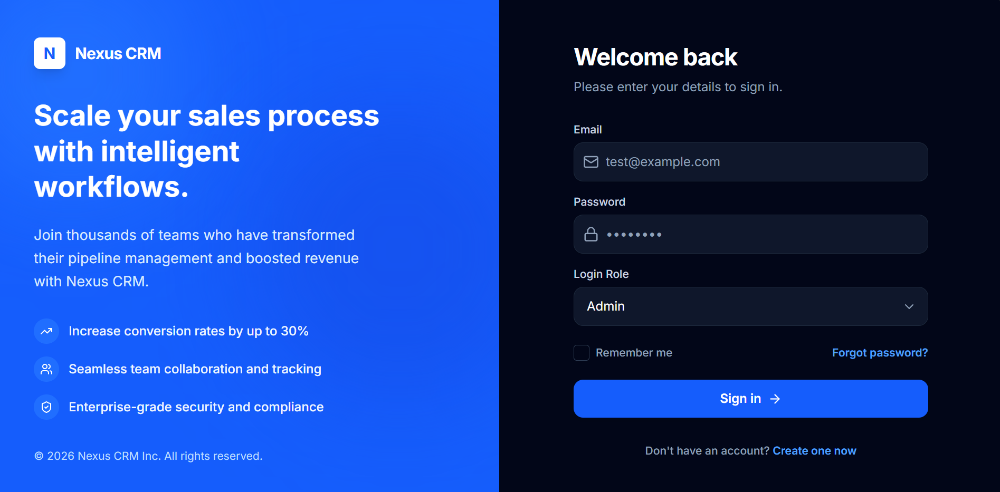

# Nexus CRM

A modern, responsive Customer Relationship Management (CRM) dashboard built with React and Tailwind CSS.

## 🚀 Tech Stack

- **Frontend Framework:** React (Vite)
- **Styling:** Tailwind CSS
- **Routing/State:** React State (useState, useEffect, useMemo)
- **Animations:** Motion (Framer Motion)
- **Icons:** Lucide React
- **Data Visualization:** Recharts
- **Date Formatting:** date-fns

## ✨ Features Implemented

1. **Authentication UI:**
   - Login and Registration pages with form validation (required fields, email format, password length).
   - Role-based authentication (Admin, Manager, Sales).
   
2. **Dashboard UI:**
   - Overview cards with key metrics (Total Revenue, Active Deals, New Leads, Win Rate).
   - Dynamic charts using Recharts for visualizing sales trends and pipeline revenue.

3. **Customer & Lead Management UI:**
   - Lead listing page with pagination and search/filtering capabilities.
   - Add and Delete lead functionalities with form validation.
   - Lead status indicators (New, Contacted, Qualified, Proposal, Won, Lost).
   - Export lead data to CSV format.

4. **Sales Pipeline UI:**
   - Visual Kanban-style drag-and-drop pipeline for managing deal stages.
   - Stage columns (Lead In, Contact Made, Needs Defined, Proposal Made, Negotiations) with calculated totals.

5. **Admin Panel UI:**
   - Role-based UI rendering (Admin panel only visible to Admins).
   - Settings for personal information, preferences (email notifications, theme).
   - User management table displaying team members and their roles/statuses.
   - Form validation for profile updates.

6. **Bonus Features:**
   - Fully responsive design (Mobile, Tablet, Desktop).
   - Global Toast Notification system for user feedback.
   - Skeleton loading states.
   - Clean navigation (Sidebar and Header with mobile hamburger menu).

## 📂 Folder Structure

```
├── src/
│   ├── assets/            # Static assets (images, icons)
│   ├── components/        # Reusable UI components (Sidebar, Header, StatCard, Skeleton)
│   ├── context/           # React Context providers (ToastContext)
│   ├── pages/             # View components (Dashboard, Leads, Pipeline, Admin, Login, Register)
│   ├── services/          # Services and mock data (mockData.ts)
│   ├── types.ts           # TypeScript interfaces and types
│   ├── utils.ts           # Utility functions (formatCurrency, cn)
│   ├── App.tsx            # Main application component and routing logic
│   ├── main.tsx           # Application entry point
│   └── index.css          # Global styles and Tailwind directives
├── package.json           # Dependencies and scripts
├── vite.config.ts         # Vite configuration
└── README.md              # Project documentation
```

## 🛠 Setup Instructions

1. **Clone the repository:**
   ```bash
   git clone <repository-url>
   cd <repository-directory>
   ```

2. **Install dependencies:**
   ```bash
   npm install
   ```

3. **Run the development server:**
   ```bash
   npm run dev
   ```

4. **Build for production:**
   ```bash
   npm run build
   ```

5. **Preview production build:**
   ```bash
   npm run preview
   ```
## 🎥 Project Demo

[](https://drive.google.com/file/d/1Du_xc2OZs4anKK1F1AvpfF0_0e2-cqsW/view?usp=drive_link)

> Click the image above to watch the full project demo.

## 📸 Screenshots

### 🔐 Login / Registration View

<p align="center">
  
</p>

### 📊 Main Dashboard

<p align="center">
  
</p>

### 👥 Leads & Customers

<p align="center">
  
</p>

### 📌 Kanban Sales Pipeline

<p align="center">
  
</p>

### ⚙️ Admin Settings

<p align="center">
  
</p>
